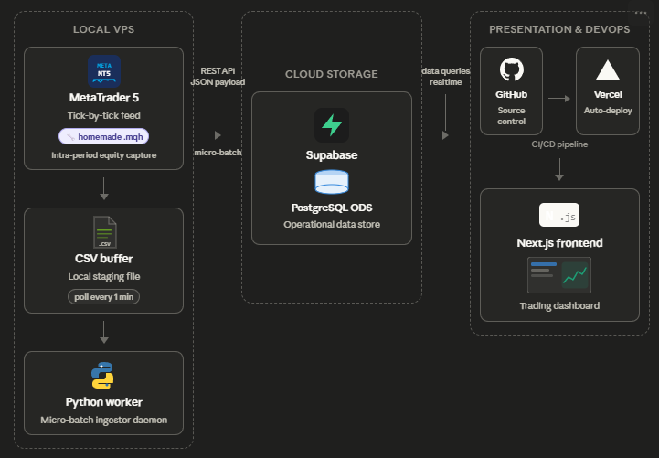

<div align="center">


# NEOTAJIB — QUANT TERMINAL

**Real-time algorithmic trading dashboard — multi-strategy, multi-platform, prop-firm aware.**

[](https://vercel.com)
[](https://nextjs.org)
[](https://supabase.com)
[](https://www.typescriptlang.org)

</div>

---

## Overview

NEOTAJIB Quant Terminal is a live trading dashboard built for algorithmic traders running multiple strategies across multiple platforms (MT4, MT5, NinjaTrader, Hyperliquid, IBKR). It pulls real-time data from a Supabase backend fed by trading EAs/bots and renders a CRT-style terminal UI optimised for monitoring during live sessions.

---

## Data Architecture



---

## Features

| Module | Description |
|--------|-------------|
| **Portfolio Chart** | Equity curve from closed trades — toggle between $ value and % drift |
| **KPI Grid** | Live balance, equity, floating P&L, daily P&L, margin used, win rate |
| **Multi-Strategy Chart** | Cumulative % performance per algo on the same chart |
| **Strategy Matrix** | Full per-algo breakdown — total P&L, today P&L, win %, profit factor, max DD, open lots |
| **Prop Risk Monitor** | Daily loss limit + max drawdown gauges with SAFE / DANGER / BREACH states |
| **Holdings Table** | All open positions with unrealized P&L |
| **Execution Flow** | Last 20 closed trades with P&L and impact gauge |
| **Reasoning Panel** | Tabbed trade event log (NEURAL / ACTIVITY / REFLECTIONS) |
| **Global Terminal** | Sticky right sidebar — live event feed colored per strategy |
| **Filter Bar** | Filter all panels simultaneously by account, platform, algo, or symbol |

---

## Tech Stack

- **Framework** — [Next.js 14](https://nextjs.org) (App Router, `"use client"`)
- **Language** — TypeScript (strict)
- **Styling** — Tailwind CSS + custom CRT/terminal CSS classes
- **Charts** — [Recharts](https://recharts.org)
- **Database** — [Supabase](https://supabase.com) (PostgreSQL + real-time)
- **Icons** — [Lucide React](https://lucide.dev)
- **Deploy** — [Vercel](https://vercel.com)

---

## Architecture

```
EA / Bot (MT4 · MT5 · IBKR)
        │
        │  HTTP / REST  (UPSERT — idempotent)
        ▼
   Supabase PostgreSQL
   ├── trade_snapshots      ← closed & open trades
   └── live_account_state   ← balance, equity, margin (heartbeat ~30s)
        │
        │  @supabase/supabase-js  (polled every 30s)
        ▼
   Next.js Dashboard (Vercel)
```

---

## Local Development

```bash
# Clone
git clone https://github.com/tnbfrombenibouyahia/istnbfrombenibouyahiamakingmoney.git
cd istnbfrombenibouyahiamakingmoney

# Install dependencies
npm install

# Set environment variables
cp .env.example .env.local
# Fill in NEXT_PUBLIC_SUPABASE_URL and NEXT_PUBLIC_SUPABASE_ANON_KEY

# Run
npm run dev
# → http://localhost:3000
```

---

## Environment Variables

| Variable | Description |
|----------|-------------|
| `NEXT_PUBLIC_SUPABASE_URL` | Your Supabase project URL |
| `NEXT_PUBLIC_SUPABASE_ANON_KEY` | Supabase publishable (read-only) key |

> The dashboard uses the **anon key** (read-only via RLS). Your EA should write using the `service_role` key — never expose it client-side.

---

## Supabase Schema

### `trade_snapshots`
Stores all trades (open and closed) pushed by EAs.

```sql
ticket        bigint
account_id    text          -- e.g. FTMO_10K_550163411
platform      text          -- MT4 | MT5 | IBKR
algo_name     text
symbol        text
lots          numeric
profit_net    numeric
open_time     timestamptz
close_time    timestamptz   -- null if still open
```

### `live_account_state`
Heartbeat table updated every ~30 seconds by the EA.

```sql
account_id      text
platform        text
balance         numeric
equity          numeric
margin_used     numeric
open_positions  int
last_update     timestamptz
```

> See [`ETL_GUIDELINES.md`](./ETL_GUIDELINES.md) for the full data pipeline spec — including recommended schema extensions, UPSERT rules, UTC timestamp handling, RLS security policies, and the feature roadmap.

---

## Roadmap

- [ ] `equity_snapshots` table → true equity curve including floating P&L
- [ ] `accounts` metadata table → data-driven prop firm rules (no more hardcoded limits)
- [ ] Direction + open price → net exposure per symbol, R-multiple distribution
- [ ] Commission / swap columns → gross vs net strategy performance
- [ ] `strategy_version` → A/B comparison across algo iterations
- [ ] STALE DATA warning when `last_update` > 2 min
- [ ] Mobile-optimised layout

---

<div align="center">
  <sub>Built by <a href="https://github.com/tnbfrombenibouyahia">tnbfrombenibouyahia</a></sub>
</div>
